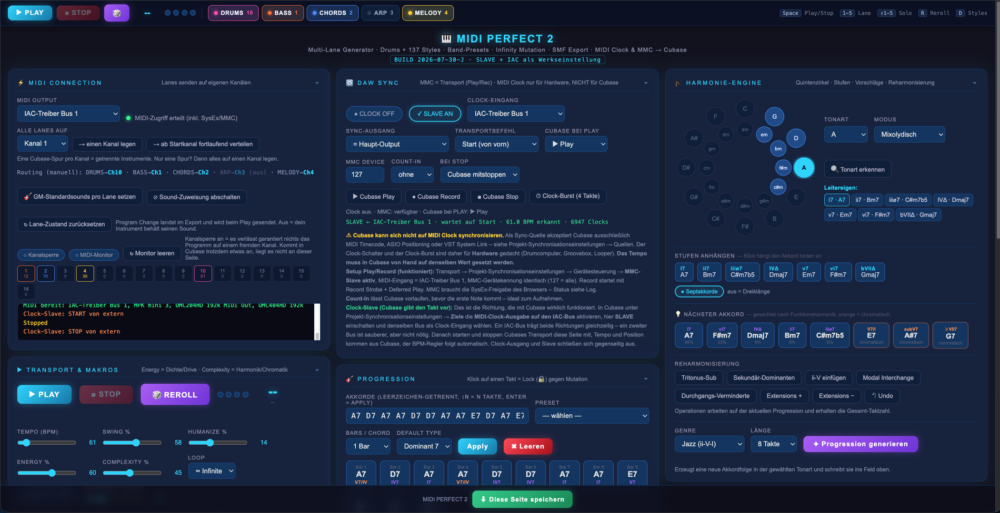

# MIDI PERFECT 2

Multi-Lane MIDI-Generator als **einzelne HTML-Datei**. Läuft ohne Server, ohne Build,
ohne Abhängigkeiten direkt im Browser und spielt über Web MIDI live in eine DAW —
entwickelt und getestet gegen **Cubase Pro 14** auf macOS über den IAC-Treiber.

```
Browser (Web MIDI)  ──IAC-Treiber Bus 1──▶  Cubase  ──▶  HALion Sonic / Groove Agent
```



Fünf unabhängige Lanes (DRUMS, BASS, CHORDS, ARP, MELODY) erzeugen aus einer
Akkordfolge deterministisch Patterns, senden sie auf getrennten MIDI-Kanälen und
lassen sich live umschalten, würfeln und mutieren. Zusätzlich: MIDI Clock und MMC
für Transport-Sync, sowie SMF-Export (Type 1, eine Spur pro Lane).

---

## Inhalt

| Datei | Zweck |
|---|---|
| `MIDI-PERFECT-2.html` | Die komplette Anwendung. Eine Datei, ~157 KB. |
| `CUBASE-SETUP.md` | Cubase-Einrichtung + die Fallstricke beim MIDI-Routing |
| `ARCHITEKTUR.md` | Aufbau des Codes, Datenmodell, Erweiterungspunkte |
| `CHANGELOG.md` | Build-Historie mit Begründung der Änderungen |
| `screenshot.png` | Die Oberfläche bei 2560 px |

---

## Schnellstart

1. **IAC-Treiber aktivieren** (macOS): Audio-MIDI-Setup → Fenster → MIDI-Studio →
   IAC-Treiber doppelklicken → *Gerät ist online* aktivieren, Bus 1 anlegen.
2. `MIDI-PERFECT-2.html` in **Chrome oder Edge** öffnen. Firefox und Safari
   unterstützen die Web MIDI API nicht.
3. MIDI-Zugriff erlauben. Bei der Abfrage **SysEx mit freigeben** — ohne SysEx
   funktioniert MMC nicht (MIDI Clock aber schon).
4. Als MIDI Output `IAC-Treiber Bus 1` wählen.
5. In Cubase pro Kanal eine MIDI-Spur anlegen → siehe [CUBASE-SETUP.md](CUBASE-SETUP.md).
   **Das ist der Schritt, an dem es üblicherweise klemmt.** Lies ihn.
6. PLAY.

### Browser-Voraussetzungen

| | Web MIDI | SysEx / MMC |
|---|---|---|
| Chrome | ✅ | ✅ (nach Freigabe) |
| Edge | ✅ | ✅ |
| Safari | ❌ | — |
| Firefox | ❌ | — |

Beim Öffnen als `file://` merkt sich Chrome die MIDI-Freigabe nicht dauerhaft.
Nach einem harten Reload (`Cmd+Shift+R`) muss sie erneut erteilt werden.

---

## Bedienung

### Kommandoleiste (klebt oben, immer erreichbar)

```
▶ PLAY   ■ STOP   🎲   1.1   ● ● ● ●   │   DRUMS 10   BASS 1   CHORDS 2   ARP 3   MELODY 4
```

Die Lane-Chips zeigen Farbe, Zustand und Zielkanal.
**Klick** = Lane an/aus · **Shift+Klick** = Solo (nochmal = alle wieder an).

### Tastatur

| Taste | Wirkung |
|---|---|
| `Space` | Play / Stop |
| `1` … `5` | Lane an/aus (Reihenfolge wie in der Leiste) |
| `⇧1` … `⇧5` | Solo auf diese Lane |
| `R` | Reroll aller nicht gesperrten Lanes |
| `D` | Alle Styles würfeln |

Shortcuts greifen nicht, während der Fokus in einem Eingabefeld oder Auswahlfeld steht.

### Panels

Jede Panel-Überschrift ist ein Schalter — Klick klappt zu. Der Zustand überlebt den
Reload. `MIDI Connection` und `Cubase Sync` sind Einrichtung; nach dem ersten Mal
kann man beide dauerhaft zuklappen.

| Panel | Inhalt |
|---|---|
| MIDI Connection | Port, Kanal-Routing, GM-Sounds, Kanalsperre, MIDI-Monitor |
| Transport & Makros | Play/Stop, BPM, Swing, Humanize, Energy, Complexity, Loop, Mutation |
| DAW Sync | MMC Play/Record/Stop, Count-In, Clock-Ausgang, **Clock-Slave** |
| Progression | Akkordfolge als Text oder Blöcke, Takt-Locks gegen Mutation |
| Harmonie-Engine | Quintenzirkel, Stufen, Vorschläge, Reharmonisierung, Generator |
| Lanes | Pro Lane: Style, Kanal, Sound, Oktave, Velocity, Density |
| MIDI Export | SMF Type 1, eine Spur pro Lane |
| Keyboard | Live-Anzeige der klingenden Noten, eingefärbt nach Lane |

---

## Konzepte

### Lanes

Fünf feste Lanes. Jede hat einen eigenen MIDI-Kanal, einen eigenen Style-Katalog,
einen eigenen Zufalls-Seed und einen Lock. Die Standardbelegung:

| Lane | Kanal | Default-Style | GM-Default |
|---|---|---|---|
| DRUMS | 10 | Rock 8tel | Standard Kit |
| BASS | 1 | Walking Bass | E-Bass (33) |
| CHORDS | 2 | Swing Comping | Flügel (0) |
| ARP | 3 | Up/Down | Clean-Gitarre (27) |
| MELODY | 4 | Motif | Trompete (56) |

**DRUMS bleibt bei den Routing-Buttons immer auf Kanal 10.** Das ist Absicht —
GM-Drums liegen dort. Wer Groove Agent benutzt, muss das in Cubase umsetzen,
nicht hier; siehe [CUBASE-SETUP.md](CUBASE-SETUP.md).

Der Lane-Zustand (an/aus, Kanal, Style, Sound, Oktave, Velocity, Density, Lock)
wird in `localStorage` gespeichert und beim nächsten Öffnen wiederhergestellt.
Der Button *Lane-Zustand zurücksetzen* verwirft ihn und lädt die Werkseinstellung.
Dasselbe gilt für die eingeklappten Panels und für das komplette
*DAW Sync*-Panel inklusive Slave-Modus und Portwahl. Beim allerersten Start
schaltet die Seite **SLAVE selbst ein und wählt den ersten IAC-Eingang** —
danach gilt, was du zuletzt eingestellt hast.

### Determinismus

Die Generatoren sind **seed-basiert und deterministisch**: gleicher Seed, gleiche
Akkordfolge, gleicher Takt → gleiches Pattern. Nur `Humanize` (Timing- und
Velocity-Streuung) ist echt zufällig und wird erst beim Senden aufgeschlagen.

Daraus folgt: Ein Pattern, das gefällt, lässt sich mit `Lock` einfrieren, während
alles andere weiter mutiert.

### Infinity / Mutation

Bei aktivem `INFINITY` würfelt der Generator am Ende jedes Loop-Durchlaufs einen
Teil der Takte und Lane-Seeds neu — die Wahrscheinlichkeit steuert der
`Mutation`-Regler. Gesperrte Takte (Klick auf einen Takt-Block) und gesperrte
Lanes bleiben unangetastet. Das ist als Übe- und Ideenmaschine gedacht: eine
Akkordfolge, die sich endlos weiterentwickelt, ohne je identisch zu sein.

### Scheduling

Der Sequencer arbeitet mit **Lookahead-Scheduling**: alle 20 ms wandern die
nächsten ~220 ms Musik mit exakten Timestamps in die MIDI-Queue
(`MIDIOutput.send(bytes, timestamp)`). Das ergibt stabile Timings trotz
JavaScript-Eventloop und hält gleichzeitig STOP praktisch sofort wirksam, weil
nie mehr als ein Fünftel einer Sekunde vorausgeplant ist.

Tempoänderungen, Style-Wechsel und Akkordänderungen greifen im laufenden Takt:
Der Take wird neu gebaut und der Zeiger auf die aktuelle Position vorgespult.
Bereits eingereihte Note-Offs behalten ihre Zeit, es bleibt also nichts hängen.

MIDI Clock läuft im selben Tick-Raster (24 Clocks pro Viertel) aus derselben
Zeitrechnung — dadurch driftet Cubase nicht gegen den Generator.

### Transport-Sync mit der DAW

Zwei Richtungen, und nur eine davon funktioniert mit Cubase in beide Richtungen:

**MMC (Generator steuert Cubase).** Play, Record und Stop gehen als SysEx raus.
Cubase muss dafür MMC-Slave aktiv haben. Braucht die SysEx-Freigabe des Browsers.

**Clock-Slave (Cubase steuert den Generator) — die empfohlene Richtung.**
Cubase sendet MIDI Clock, der Generator hängt sich dran: Start, Stop, Position und
Tempo kommen aus der DAW, der BPM-Regler folgt sichtbar mit. Das ist auch
architektonisch richtig — die DAW hält die Zeit.

```
Cubase  ──MIDI Clock (F8/FA/FB/FC/F2)──▶  IAC Bus  ──▶  MIDI PERFECT
MIDI PERFECT  ──Noten──▶  IAC Bus  ──▶  Cubase
```

Ein IAC-Bus trägt beide Richtungen gleichzeitig; ein zweiter Bus ist sauberer,
aber nicht nötig. Solange Slave aktiv ist, werden Clock-Ausgang und MMC-Rück-
sendungen unterdrückt — es kann keine Rückkopplungsschleife entstehen.

**Clock-Ausgang (Generator als Master).** Sendet MIDI Clock plus Start/Stop.
Für Hardware gedacht — Drumcomputer, Groovebox, Looper.
**Cubase kann sich nicht auf eingehende MIDI Clock synchronisieren** (siehe
Bekannte Grenzen). Setup und Hintergrund: [CUBASE-SETUP.md](CUBASE-SETUP.md).

### Kanalsperre und MIDI-Monitor

Zwei Diagnosewerkzeuge im MIDI-Connection-Panel:

- **Kanalsperre** blockt vor dem Senden jede Nachricht auf Kanälen, die keiner
  eingeschalteten Lane gehören — inklusive Program Change und All-Notes-Off.
  Kommt in der DAW trotzdem etwas an, liegt es beweisbar nicht an dieser Seite.
- **MIDI-Monitor** protokolliert jede ausgehende Nachricht mit Kanal und Typ:

```
SEND  Ch10  NoteOn  36 v110
SEND  Ch10  NoteOff 36 v0
BLOCK Ch 1  CC     123 v0
```

Beides sitzt an einer einzigen zentralen Sendefunktion (`sendAt`), es kann also
keine Nachricht daran vorbei.

---

## Export

`MIDI Export` schreibt ein **Standard MIDI File Type 1** mit einer Spur pro
aktiver Lane, inklusive Tempo, Taktart, Spurnamen und Program Change. Die Datei
lässt sich direkt in Cubase ziehen; jede Lane landet auf einer eigenen Spur.

Program Change wird nur geschrieben, wenn im Lane-Panel ein Sound gewählt ist.
Steht dort *aus*, behält das Instrument in der DAW seinen eigenen Klang.

---

## Bekannte Grenzen

- **Nur Chrome/Edge.** Web MIDI ist in Safari und Firefox nicht implementiert.
- **Cubase kann nicht auf MIDI Clock slaven.** Als Sync-Quelle akzeptiert Cubase
  nur MIDI Timecode, ASIO Positioning oder VST System Link — MIDI Clock ist bei
  Steinberg seit der Umstellung auf die lineare Zeit-Engine reine Ausgabe.
  Deshalb gibt es den Clock-Slave-Modus: Cubase ist Master, der Generator folgt.
- **MIDI-Input nur für Clock.** Die Seite wertet ausschließlich die Realtime-Bytes
  F8/FA/FB/FC und den Songposition-Pointer F2 aus. Noten-Input gibt es nicht.
- **Fünf feste Lanes.** Die Lane-Liste ist ein Array im Code, keine UI zum
  Hinzufügen. Erweitern ist trivial (siehe ARCHITEKTUR.md), aber nicht anklickbar.
- **Kein Undo für Lane-Einstellungen.** Nur die Progression hat eine Undo-Historie.
- **`localStorage` ist pro Dateipfad.** Verschiebt man die HTML-Datei, sind
  Lane-Zustand, Panel-Zustand und DAW-Sync-Einstellungen weg.

---

## Lizenz

Privates Projekt. Keine Lizenz vergeben — alle Rechte vorbehalten,
sofern nicht anders vereinbart.
